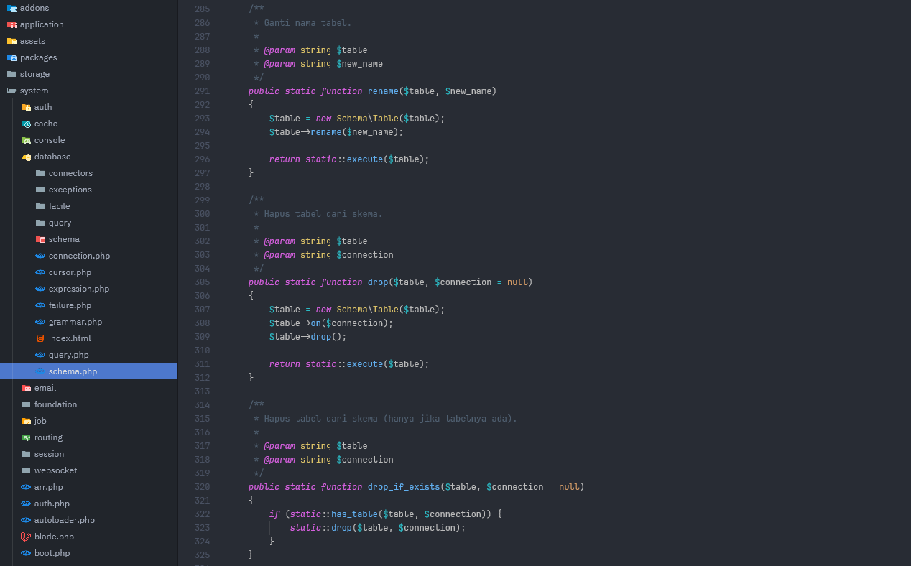

# Zed One Dark Soft

A softer port of the popular [One Dark](https://github.com/one-dark/vscode-one-dark-theme) theme for Zed Editor.

## Installation

### From Zed Extensions

1. Open Zed Editor
2. Press `Cmd+Shift+P` (macOS) or `Ctrl+Shift+P` (Windows/Linux)
3. Type "zed: extensions"
4. Search for "One Dark Soft"
5. Click Install

### Manual Installation

1. Clone this repository
2. Copy to your Zed extensions folder:
   - macOS/Linux: `~/.config/zed/extensions/`
   - Windows: `%APPDATA%\Zed\extensions\`
3. Reload Zed
4. Select theme via Command Palette → "theme selector: toggle"

## License

MIT License - See [LICENSE](LICENSE) file for details
